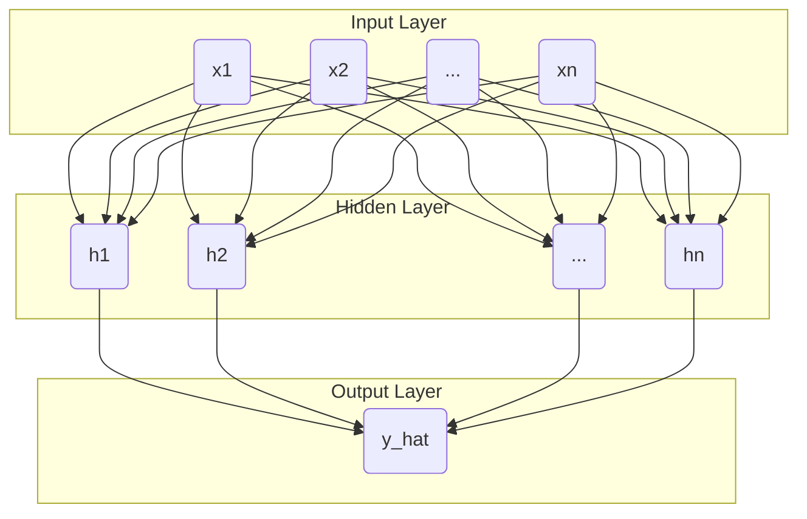
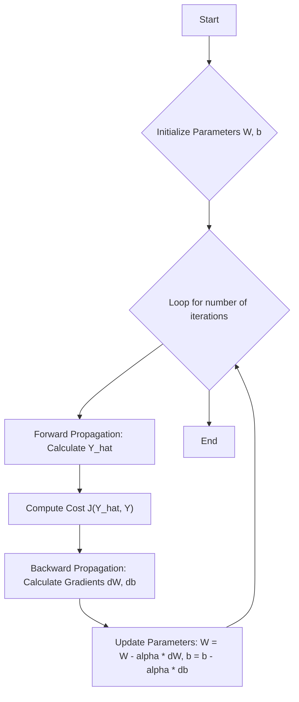

## Objective

This manual describes the gradient descent algorithm implemented by the repository. All information provided is for educational purposes and personal systematization.

## Taxonomy

*   **Neural Network:** A computational model inspired by the structure and function of the human brain. It learns to recognize complex patterns in training data and can then be used to make predictions on new, unseen data.
*   **Hidden Layer:** A layer of neurons located between the input and output layers of a neural network. It's called "hidden" because it has no direct connection to the outside world (input or output).
*   **Shallow Neural Network:** A neural network with only one hidden layer.
*   **Deep Neural Network:** A neural network with more than one hidden layer.

## Data Representation

To train a neural network, we need a dataset. This dataset is typically split into a training set and a testing sets. These sets follow a specific notation: 

*   `X`: The input data, represented as a matrix of shape (`n_x`, `m`).
*   `Y`: The corresponding labels or true values for the input data, represented as a vector of shape (`1`, `m`).
*   `m`: The number of examples in the dataset.
*   `n_x`: The number of features for each example.

## Neural Network Architecture

A neural network is composed of layers of interconnected nodes (neurons).

*   **Input Layer:** Receives the initial data (features `X`). The number of neurons in this layer is equal to `n_x`.
*   **Hidden Layers:** Perform computations and pass information from the input layer to the output layer. The number of hidden layers and the number of neurons in each layer are hyperparameters that can be tuned.
*   **Output Layer:** Produces the final prediction (`Y_hat`). The number of neurons in the output layer depends on the task (e.g., 1 for binary classification, `n` for multi-class classification).

### Shallow Neural Network Schema

## Gradient Descent

Gradient descent is an iterative optimization algorithm used to train neural networks. The goal is to find the optimal values for the model's parameters (weights `W` and biases `b`) that minimize a cost function `J`.

### The Training Process

The key steps are:

1.  **Initialize Parameters:** Assign small, random values to the weights (`W`) and zeros to the biases (`b`) for each layer.
2.  **Loop:** Repeat for a specified number of iterations.
    *   **Forward Propagation:** Feed the training data through the network to generate a prediction (`Y_hat`).
    *   **Compute Cost:** Calculate the error or "cost" (`J`) by comparing the prediction (`Y_hat`) with the true labels (`Y`).
    *   **Backward Propagation:** Calculate the gradients (derivatives) of the cost function with respect to each parameter. This tells us how each parameter contributed to the error.
    *   **Update Parameters:** Adjust the weights and biases in the opposite direction of their gradients. The `alpha` in the diagram is the learning rate, which controls the step size.

This cycle is repeated until the cost is minimized, resulting in a trained model.

## Vectorized Implementation

Here is a more detailed look at the vectorized implementation for a deep neural network.

### Forward Propagation
Initialize `A[0] = X`.

**For `l` from 1 to `L`:**
*   `Z[l] = W[l] . A[l-1] + b[l]`
*   `A[l] = g[l](Z[l])` (where `g` is the activation function)

### Cost Function (Binary Classification)
`J = -1/m * (Y . log(A[L].T) + (1 - Y) . log(1 - A[L].T))`

### Backward Propagation
`dA[L] = - (Y / A[L] - (1 - Y) / (1 - A[L]))`

**For `l` from `L` down to 1:**
*   `dZ[l] = dA[l] * g'[l](Z[l])` (where `g'` is the derivative of the activation)
*   `dW[l] = 1/m * dZ[l] . A[l-1].T`
*   `db[l] = 1/m * sum(dZ[l], axis=1)`
*   `dA[l-1] = W[l].T . dZ[l]`

### Update Parameters
**For `l` from 1 to `L`:**
*   `W[l] = W[l] - learning_rate * dW[l]`
*   `b[l] = b[l] - learning_rate * db[l]`
